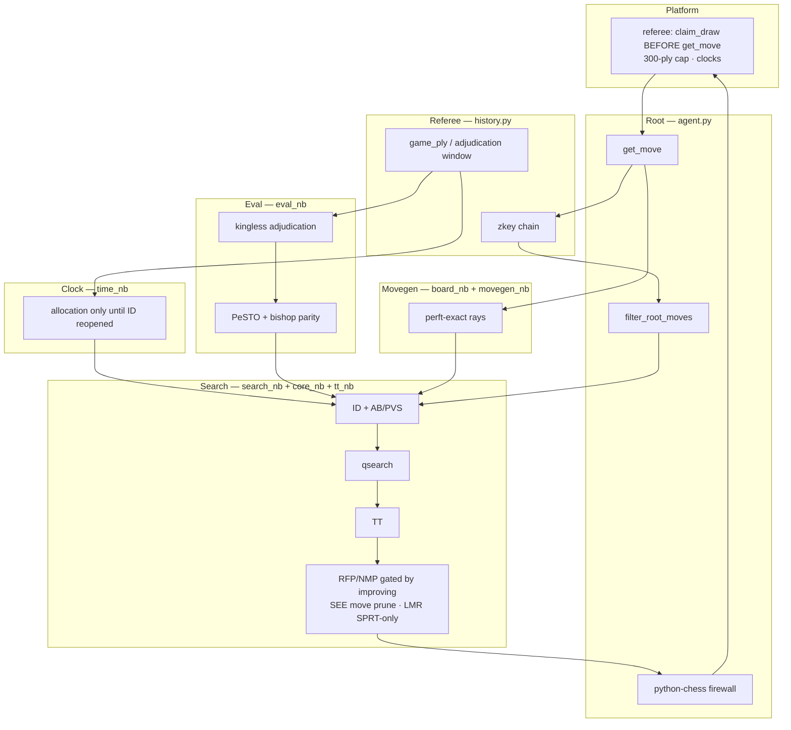
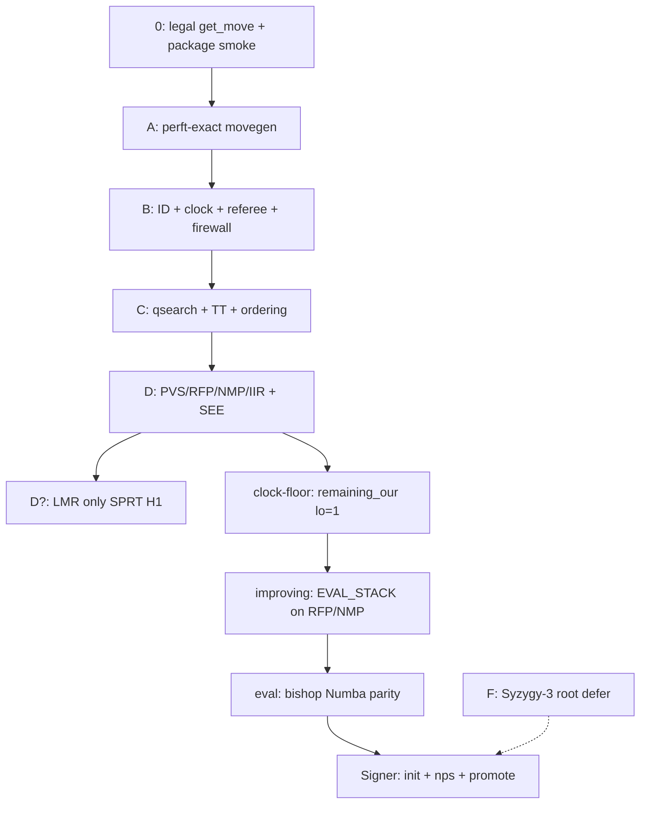

# Chess TK — System Web

**Status:** living scaffold (3 Sep 2026, Phase 2 additive circuit). Synthesized from independent review, council agents, and measured state on the Linux signer.

**Relationship to other docs**

| Document | Role |
|---|---|
| [AGENTS.md](../AGENTS.md) | Philosophy, freeze cut, non-negotiables |
| [ENGINEERING.md](../ENGINEERING.md) | Build contract, brick definitions, gates |
| **This file** | Architecture, pipelines, promotion protocol, feature web |
| [aichessathon.com/docs](https://aichessathon.com/docs) | Contest physics — **wins on conflict** |

**How to use this file:** Read before adding any feature. Every change must name its **layer**, **brick**, **gate**, and **upstream invariants**. If you cannot, the change does not merge.

---

## 1. Winning thesis (Swiss, not CCRL)

We do not win by shipping the CPW shopping list first. We win by being the **least-broken classical searcher that plays this referee**.

| Swiss seat killer (ordered) | Our answer |
|---|---|
| Flag / crash / illegal / init timeout | Never-flag ID, 400 ms hard margin, panic without qsearch, python-chess firewall |
| Auto-claimed draw of a won game | Full-game `_transposition_key()` chain + winning root filter + search rep = 0 |
| Lost game from ignoring 300-ply adjudication | `game_ply` counter + kingless eval in last 16 plies |
| Depth starvation on 1 core | Sound pruning only (SEE, improving) after perft-green movegen |
| Half-integrated zip explosion | **One brick per promotion**; `last-good.zip` is sacred |

**Elo is secondary to seats.** A +30 cp feature that adds 0.1% flag risk is a net loss in a 13-round Swiss.

---

## 2. The interlocking web

Nothing is a solo hero. The engine is a **circuit**:

```
Platform referee
    ↓ fen, time_left_ms
agent.py (root firewall)
    ↔ history.py (referee physics)
    ↔ time_nb.py (clock)
    → board_nb / movegen_nb (truth of position)
    → eval_nb (objective function)
    → search_nb / core_nb (depth)
    → tt_nb (memory across our moves)
    ↔ tb_nb (optional root oracle)
    ↓ legal UCI
Platform referee
```

**Coupling rules**

1. **Referee constrains root** before search runs (`filter_root_moves`).
2. **Root constrains search** (packed move list, `game_zkeys`, adjudication flag).
3. **Clock constrains search** (soft/hard/panic; increment not spent).
4. **Movegen constrains everything** — if perft is red, nothing else matters.
5. **Eval must match referee** in the adjudication window (kingless material).
6. **Eval must match across Python root and Numba** for any shipped term (bishop pair, PeSTO). Split-brain gifts auto-draws.
7. **Node prunes (RFP/NMP) need a trustworthy static eval.** Improving is the bridge so they do not fire while the score is dropping. SEE is the move-level tactical net — do not retune SEE in the same zip as improving.
8. **Clock constrains ID via allocation only** until dynamic ID is reopened. Numba abort is **node budget**, not wall clock inside a depth.
9. **Packaging validates the whole circuit** on the Linux signer, not the laptop.



---

## 3. Layer architecture

Each layer exposes a **contract**. Downstream layers may assume the contract; upstream layers must not break it.

### 3.1 Movegen (Brick A)

| | |
|---|---|
| **Modules** | `tables_nb.py`, `board_nb.py`, `movegen_nb.py`, Numba mirror in `core_nb.py` |
| **Outputs** | Packed legal moves; make/unmake; zobrist key; FEN round-trip |
| **Invariants** | Perft-exact vs python-chess oracle; underpromotion; EP; castling |
| **Failure mode** | Perft red → **living searcher = python-chess AB** in `search_nb`, not buggy Numba |

### 3.2 Eval

| | |
|---|---|
| **Modules** | `eval_nb.py`, `pesto_nb` in `core_nb.py` |
| **Outputs** | Centipawn score (STM); kingless material when `adjudicate=True` |
| **Invariants** | Vanilla PeSTO in freeze; **Numba and Python eval must match** for any shipped term |
| **Forbidden** | Texel-on-PST, pawn-structure forest, `torch`/onnx in agent |

### 3.3 Search

| | |
|---|---|
| **Modules** | `search_nb.py` (Python fallback), `core_nb.py` (Numba hot path), `tt_nb.py` |
| **Inputs** | Position, filtered root moves, `game_zkeys`, clock budget, adjudication flag |
| **Invariants** | ID always has legal fallback; repetition = 0 in tree; qsearch evasions if in check; mates ply-adjusted in TT; panic **no qsearch** |
| **Hot path** | `core_nb.search_root` when `NUMBA_READY` and warmup &lt; 50 s |

### 3.4 Clock (Brick B)

| | |
|---|---|
| **Modules** | `time_nb.py` |
| **Outputs** | `('panic', 0, 0)` or `('search', soft_ms, hard_ms)` |
| **Invariants** | Hard margin hundreds of ms; increment credited after return; abort ID if &lt; 200 ms left |
| **Extensions (measured)** | Late `remaining_our` floor 1 (ply ≥ 262). Dynamic ID (`soft_budget` / `early_stop_ok`) is **killed** this week |

### 3.5 Referee / draw (Brick B)

| | |
|---|---|
| **Modules** | `history.py` |
| **Outputs** | `filter_root_moves`, `zkeys()`, `game_ply()`, `use_adjudication_eval()` |
| **Invariants** | Track served FEN keys + after our legal pushes; **never infer opponent UCI**; 300-ply = this game's `move_stack`, not FEN `fullmove` |
| **Tests** | `lab/test_b.py`, `lab/referee_smoke.py` (no agent import) |

### 3.6 Root orchestration

| | |
|---|---|
| **Modules** | `agent.py`, optional `tb_nb.py` |
| **Flow** | observe → eval → win/lose → filter → TB probe → allocate → search → firewall → observe our move |
| **Invariants** | Illegal internal move → filtered legal; exception → first filtered legal |

### 3.7 Packaging & signer

| | |
|---|---|
| **Modules** | `harness/package.py`, `lab/docker/Dockerfile` |
| **Outputs** | `agent.py` at zip root; optional `--include syzygy` |
| **Invariants** | ≤ 50 MB unzipped; pack on **Linux x86_64 Python 3.12**; never Windows ARM freeze |

---

## 4. Hot path vs cold path

| Path | When | What runs |
|---|---|---|
| **Cold** | Every move | python-chess parse, `history`, `time_nb.allocation`, root filters, TB probe |
| **Hot** | `NUMBA_READY` | `core_nb.search_root` — make/unmake, eval, TT, PVS, prunes |
| **Warm fallback** | Numba fail / warmup timeout | `search_nb.iterative_deepening` — AB + qsearch + TT, no Brick D prunes |

**Split-brain hazards (must fix before promotion)**

| Hazard | Status | Fix |
|---|---|---|
| Bishop pair | HEAD has Python + `pesto_nb`; see-main last-good is vanilla | Ship via **bp-numba** brick after improving; equality test before promote |
| LMR in Numba, not last-good | **Open** | `ENABLE_LMR = False` until SPRT H1 |
| Dual TT (Python vs Numba) | Accepted | Same semantics; different storage |
| HEAD = stew of unmeasured bricks | **Open** | Stage from `dist/last-good` only (`lab/stage_*.py`) |
| Dynamic ID in HEAD `core_nb` | **Killed** | Do not pack HEAD; floor-only via `stage_clock_v1 --variant floor` |

---

## 5. Brick DAG (ground up)



### Brick inventory (current)

| Brick | In last-good (signer) | In local HEAD | Freeze? |
|---|---|---|---|
| 0 | ✓ | ✓ | First upload |
| A | ✓ | ✓ | Yes |
| B | ✓ | ✓ + draw-seek + late clock | Yes |
| C | ✓ | ✓ | Yes |
| D core + SEE | ✓ see-main (no LMR) | ✓ + stew | Opportunistic |
| clock-floor | MEASURE / close | coded | Seat insurance |
| clock-id | **KILL** | coded | Do not ship |
| improving | — | coded | Next Elo brick |
| bishop Numba | — | Python + `pesto_nb` | After improving |
| Syzygy-3 root | — | coded, tables local | Defer post-freeze |

**Minimum Swiss zip:** Bricks **0 + A + B + C**, signed on Linux, flag-rate 0.

---

## 6. Ranked feature queue (independent review)

Sorted by **expected Swiss impact** (seat preservation first, then depth).

| Rank | Feature | Verdict | Next gate |
|---:|---|---|---|
| 1 | Winning root filter | **KEEP** | `referee_smoke`, `test_b` |
| 2 | Never-flag ID + panic | **KEEP** | flag-soak |
| 3 | Losing claim preference | **KEEP** | `referee_smoke` |
| 4 | 300-ply adjudication eval | **KEEP** | `referee_smoke` |
| 5 | Search repetition = 0 | **KEEP** | `test_b` |
| 6 | Brick D (PVS/RFP/NMP/IIR) | **KEEP** | perft + soak |
| 7 | Qsearch + TT + ordering | **KEEP** | `test_c` |
| 8 | SEE main prune | **KEEP** | promoted see-main (149 @ 54%, fails=0) |
| 9 | Improving flag | **MEASURE** | after clock-floor disposition; 80–120 screen |
| 10 | Late clock floor | **MEASURE / close** | soak 0-fail + 2×120s smoke (3s Elo is noise) |
| 11 | Dynamic ID clock | **KILL** | 1 flag in 40; do not restage |
| 12 | Bishop pair | **MEASURE after 9** | `pesto_nb` parity + soak 40 |
| 13 | LMR | **DEFER/KILL** | dedicated SPRT H1 only |
| 14 | Syzygy-3 root | **DEFER** | init &lt; 60 s on signer |
| — | Ponder, magics, 4pc TB, eval forest, opponent UCI infer, trap book | **KILL** | — |

---

## 7. Measurement & promotion pipeline

### 7.1 Where truth lives

| Environment | Role | Trust for |
|---|---|---|
| **Windows laptop** | Edit, `gates_laptop`, perft `--quick` | Correctness scaffolding only |
| **Linux signer** (2 vCPU host) | Gauntlet, pack, promote | init, nps, flag-rate, SPRT |
| **Docker 1c/2g** | Cold `import agent`, bench | Init budget, RAM envelope |

**Laptop is a liar** for nps, JIT seconds, and Elo.

### 7.2 Gate DAG

```
perft ──► unit (gates_laptop + test_b on signer) ──► flag-soak ──► screen ──► SPRT? ──► manual promote
```

| Gate | Pass criterion | Tool |
|---|---|---|
| **perft** | Engine = oracle | `python -m lab.perft` |
| **unit** | Brick tests green | `python -m lab.gates_laptop` (+ `test_b` on signer) |
| **flag-soak** | `our_fail == 0` | `lab.gauntlet` vs greedy, mixed openings |
| **screen** | ≥120 games, ≥53% keep / ≤49% kill | `lab.screen` merge JSONL |
| **SPRT** | H1 + fails=0 (optional, one/week) | `gauntlet --sprt --opponent last-good` |
| **promote** | Human copies zip | `cp dist/candidate.zip dist/last-good.zip` |

**Gauntlet never promotes automatically.**

### 7.3 One brick per zip

1. Branch mentally from **`last-good`**, not from failed candidate.
2. Change **one logical variable** (one row in §6).
3. Laptop: `perft --quick` → `gates_laptop` → pack `dist/candidate.zip`.
4. Rsync to signer; run full gate DAG.
5. Record promotion in `lab/logs/promotions.jsonl` (manual).
6. Retain `last-good.prev1.zip` snapshot.

### 7.4 Two-worker pattern (2 vCPU)

The opponent string `last-good` **forces `--sprt`** in `lab.gauntlet`. Screens must pass a **path**: `--opponent dist/last-good`.

Simultaneous cold JIT on two workers caused init-timeout OUR_FAILs (~108 s = 2×60 s). **Never start W2 until W1 has finished its first game import.**

```bash
# Worker 1 — path opponent, no auto-SPRT
python3.12 -m lab.gauntlet --agent dist/candidate --opponent dist/last-good \
  --game-offset 0 --hours 4 --base-ms 3000 --increment-ms 50 \
  --log lab/logs/exp-w1.jsonl

# Worker 2 — only after first "game 1:" line on W1
python3.12 -m lab.gauntlet --agent dist/candidate --opponent dist/last-good \
  --game-offset 400 --hours 4 --base-ms 3000 --increment-ms 50 \
  --log lab/logs/exp-w2.jsonl

python3.12 -m lab.screen lab/logs/exp-w1.jsonl lab/logs/exp-w2.jsonl
```

**SPRT:** one worker only (serial self-play pairs). `--opponent last-good` is correct for SPRT.

**One experiment owns the box.** Do not start a second brick's gauntlet while a screen is running.

### 7.5 Rollback

| Trigger | Action |
|---|---|
| `our_fail > 0` in any gate | Discard candidate; keep `last-good` |
| Platform init crash | Restore `last-good.prev1.zip`; re-upload |
| Screen KILL | Revert brick commit |
| SPRT H0 | Do not promote |

---

## 8. Sequenced build plan (Phase 2 additive circuit)

**Parent of every zip is unpacked `dist/last-good` on the signer**, never laptop HEAD. Stage with `lab/stage_clock_v1.py`, `lab/stage_improving.py`, `lab/stage_bp_numba.py`.

**Precondition:** see-main is last-good (KEEP).

| Step | Zip name | Single change vs prior | Gate |
|---:|---|---|---|
| 0 | — | Demote LMR (`ENABLE_LMR=False`) | done |
| 1 | `see-main` | Main-search SEE prune only | **KEEP** — promoted |
| 2a | `clock-floor` | `remaining_our` clamp lo 1 (ply ≥ 262) | soak 40 fails=0; screen 0-fail (3s Elo is noise); **2×120s sequential smoke** |
| 2b | — | Dynamic ID | **KILL** — 1 flag / 40; do not restage |
| 3 | `improving` | `EVAL_STACK` gates RFP and NMP | soak 40; screen 80–120 vs **path** last-good; fails=0; KEEP ≥53% or HOLD |
| 4 | `bp-numba` | Bishop pair in `pesto_nb` matching Python | `test_c` equality + soak 40 |
| 5 | **freeze** | No new features | Docker cold import + real-TC smoke |

If clock-floor **fails** (any `our_fail`): skip 2a; step 3 vs see-main last-good.

If clock-floor score is 49–53% with fails=0: still promote if 120s smoke is green — seat insurance, not an Elo KEEP story.

**LMR / Syzygy-3 / magics:** not in steps 1–5.

**3s screen vs last-good does not measure late-floor Elo** (games almost never reach ply 262). The gate is `our_fail == 0` plus real-TC smoke.

---

## 9. Developer workflows (frictionless)

### 9.1 Laptop daily loop

```powershell
# After any edit
python -m lab.perft --quick
python -m lab.gates_laptop

# Before rsync to signer — pack the *staged* tree, not HEAD
python -m lab.stage_improving dist/improving
# then pack from dist/improving on the signer
```

**Do not** `python -m lab.test_b` on laptop unless you accept Numba JIT wait.

### 9.2 Signer promotion loop

```bash
# Pause collectors first
systemctl --user stop internwatch.service meta-collector.service

python3.12 -m lab.perft
python3.12 -m lab.gates_laptop
python3.12 -m lab.test_b
python3.12 -m harness.package --include syzygy --out dist/candidate.zip

# tmux soak (§7.4) → screen → optional SPRT
# Manual promote:
cp dist/candidate.zip dist/last-good.zip
```

### 9.3 Adding a feature (checklist)

- [ ] Which **layer** (§3)?
- [ ] Which **brick** (§5)?
- [ ] Which **invariants** must not break?
- [ ] **Perft** still green?
- [ ] **Unit** test added (prefer no-agent import)?
- [ ] **One variable** in candidate zip?
- [ ] **Gate** named (soak / screen / SPRT)?
- [ ] Numba **parity** if eval or root behaviour changes?

---

## 10. State & memory model (one game)

| State | Location | Cleared when |
|---|---|---|
| Transposition keys seen | `history._seen` | New game (new process) |
| Zkey chain for search | `history._zkeys` | New game |
| Game ply counter | `history._game_ply` | New game |
| Python TT | `tt_nb.tt` | Persists our moves; `new_search()` per root |
| Numba TT | `core_nb` arrays | Persists our moves; age bump per root |
| Killers / history / eval stack | per-search scratch | Each `search_root` |
| Syzygy handle | `tb_nb._tb` | Process lifetime (lazy open) |
| `NUMBA_READY` | `core_nb` | Once at import |

---

## 11. Kill list (this freeze week)

Do not implement or promote without reopening council:

- Bundle local HEAD as one zip
- LMR without SPRT H1
- Dynamic ID (`soft_budget` / sticky `asp_failed` / `early_stop_ok` bundle)
- Ponder (freeze doctrine; race risk)
- Magic finder / magics rewrite
- 4–5 piece Syzygy
- ProbCut, singular, razoring, root multi-PV
- Eval forest (passed pawn, mobility, king safety, Texel)
- Opponent UCI inference
- Trap-biased opening book
- Contempt / eval inflation when winning
- `import torch` / onnxruntime
- Panic capture-only search

---

## 12. Post-freeze sophistication (queue, not now)

After `last-good` is frozen for Swiss, consider **one at a time** with gates:

| Idea | Layer | Why wait |
|---|---|---|
| Countermove history | Search | Needs stable D + screen |
| 3pc search TB probes | Root/Search | After root TB init gated |
| Opening regen (balanced, not traps) | Lab | Telemetry for gauntlet |
| Ponder stop-join | Root/Clock | Needs 2-process harness test |
| Copied magic numbers | Movegen | Only if signer nps &lt; 250k |

---

## 13. Artifacts

| Path | Purpose |
|---|---|
| `dist/last-good.zip` | Sacred Swiss candidate |
| `dist/last-good.prev1.zip` | Rollback snapshot |
| `dist/candidate.zip` | Current experiment |
| `lab/logs/*.jsonl` | Gauntlet rows (`our_fail`, WDL) |
| `lab/logs/promotions.jsonl` | Manual promotion audit trail |
| `lab/openings.fen` | Private gauntlet positions |
| `syzygy/` | 3-piece tables (optional include) |

**Promotion log row (example):**

```json
{"ts":"2026-09-03T18:30:00Z","brick":"see-main","parent":"last-good-d","gates":["perft","unit","screen-KEEP","soak-0-fail"],"games":224,"score":0.541,"notes":"SEE only vs last-good"}
```

---

## 14. Council charter (how we evolve this doc)

When adding a section or feature:

1. **Architecture agent** — layer contract + invariants
2. **Measurement agent** — gate + signer command
3. **Referee agent** — harness alignment
4. **Lead** — brick DAG update + kill-list check

No feature merges without updating **§6 rank** or **§8 sequence** and a green gate name.

---

## 15. Quick reference

| I want to… | Command |
|---|---|
| Laptop correctness | `python -m lab.gates_laptop` |
| Full perft | `python -m lab.perft` |
| Pack zip | `python -m harness.package --include syzygy --out dist/candidate.zip` |
| Fast soak | `python -m lab.gauntlet --games 20 --opponent baselines/greedy` |
| Screen merge | `python -m lab.screen lab/logs/w1.jsonl lab/logs/w2.jsonl` |
| Screen vs last-good | `python -m lab.gauntlet --agent dist/c --opponent dist/last-good` (path, not the string) |
| SPRT vs last-good | `python -m lab.gauntlet --agent dist/c --opponent last-good --sprt` |
| Stage floor | `python -m lab.stage_clock_v1 dist/clock-floor --variant floor` |
| Stage improving | `python -m lab.stage_improving dist/improving` |
| Stage bishop pair | `python -m lab.stage_bp_numba dist/bp-numba` |

**Swiss zip = `last-good`, not HEAD, not last push.**
